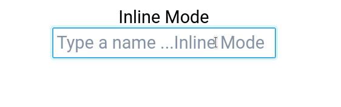
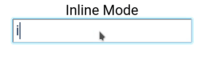
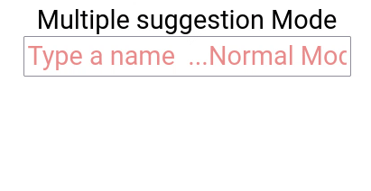

# Introduction

> Hints + input  = Hintput









# Installation
> yarn add @ribrary/hintput

> npm i  @ribrary/hintput

# Example:
> https://rhnh.github.io/hintput/
-------------
> [Source for example](https://github.com/rhnh/hintput-examples) 

# Usage
use is just like an input box.
You need to function, if you want to retrieve the value of input
- an example
```jsx
  const items = ['james','john doe', 'jane doe'];
  <p>
        <label htmlFor="favorite">Favorites: </label>
        <Hintput
          placeholder="favorite" 
          //This color has be hex. If you want have matching hint color.
          style={{color:"#2a9d8f"}}
          items={["James","John","Ali","Sam"]}
        />
</p>
```
----------------------------
# FAQs

### How do I change number of suggestions in multiple mode ?
```jsx
  const items = ['james','john doe', 'jane doe'];
  <p>
        <label htmlFor="names">Favorites: </label>
        <Hintput
          placeholder="Names" 
          items={items}
          numberOfSuggestions={3}
        />
</p>
```
### How do I change color of hint ?

Usually, it picks automatically, because if you give style={{color:"#ff0033"}}, it selects appropriate color for hint.
But if you want add your own color. use hintColor
```jsx
  const items = ['james','john doe', 'jane doe'];
  <p>
        <label htmlFor="favorite">Favorites: </label>
        <Hintput
          placeholder="favorite" //optional 
          items={items}
          hintColor={"#e3e3e3"}
        />
</p>
```


### How do I increase or decrease opacity of hint color ?
```jsx
  const items = ['james','john doe', 'jane doe'];
  <p>
        <label htmlFor="favorite">Favorites: </label>
        <Hintput
          placeholder="favorite"
          items={items}
          fadePercentage={0.95}
        />
</p>
```

### Can I use it for Arabic Text ?

Yes, change textDirection to right
```jsx
  const items = ['james','john doe', 'jane doe'];
  <p>
        <label htmlFor="favorite">Favorites: </label>
        <Hintput
          placeholder="favorite"
          items={items}
          textDirection="right"
        />
</p>
```
### How to disable the auto complete on the spot ?
> press shift+Backspace 

### How do I add custom style ?
```jsx
  const items = ['james','john doe', 'jane doe'];
  <p>
        <label htmlFor="favorite">Favorites: </label>
        <Hintput
          placeholder="favorite"
          items={items}
         style={{color:"#ff000"}}
        />
</p>
```
Add "btnContainer={{//your styles}}" to change container style for multiple hints.

```jsx
  const items = ['james','john doe', 'jane doe'];
  <p>
        <label htmlFor="favorite">Favorites: </label>
        <Hintput
          placeholder="favorite"
          items={items}
         style={{}}
         container={{}} 
        />
</p>
```
Add "buttonsStyle={{//your styles}}" to change multiple search buttons
```jsx
  const items = ['james','john doe', 'jane doe'];
  <p>
        <label htmlFor="favorite">Favorites: </label>
        <Hintput
          placeholder="favorite"
          items={items}
         style={{}}
         container={{}} 
        />
</p>
```
You can also add classes
 - buttonsClass,
 - containerClass,
 - btnContainerClass in multiple
 - hint-buttons: for buttons in multiple mode


You can give own or you these.

for main input

 - hint-put 
 -  hintput-text 
 
for secondary input
 - hint-put 
 - hintput-hint